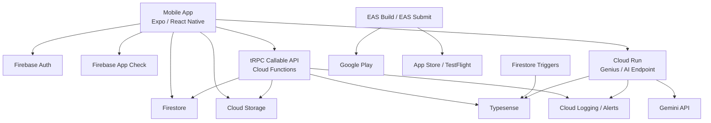

# Sahaay Production Readiness, Cloud, and Store Deployment Audit

**Date:** April 2026 (updated)  
**Last Updated:** 2026-04-02 — Phase 1 launch hardening complete; new findings from weekly technical debt scan added.  
**Audience:** Founder, engineering, product, operations, investors  
**Objective:** Replace the previous speculative self-review with a grounded audit of the current `Sahaay` repository, focused on production readiness, cloud economics, app-store deployment, and the mandatory work still required before launch.

---

## 1. Executive Verdict

- `Sahaay` is currently a Firebase-first mobile marketplace, not a cloud-agnostic platform.
- The cheapest cloud choice for this codebase today is `GCP/Firebase`, not because it always has the lowest raw unit prices, but because the app already depends on Firebase Auth, Firestore, Cloud Functions, Cloud Storage, App Check, Android Firebase config, and EAS workflows.
- You do **not** need your own cloud just to publish an app to Google Play or the Apple App Store. You upload signed binaries to the stores directly.  
- You **do** need a live backend for `Sahaay` itself, because the current product depends on remote auth, database, storage, functions, search, and AI services.
- Current state: good internal prototype momentum, but still **not production-ready** for app
-  stores or scale.

---

## 2. What The Repository Actually Is

| Area             | Current State                                                                       | Notes                                                                             |
| ---------------- | ----------------------------------------------------------------------------------- | --------------------------------------------------------------------------------- |
| Monorepo         | `frontend` + `firebase/functions` under PNPM/Turbo                                  | Mobile app plus Firebase backend, not a multi-service cloud platform yet          |
| Mobile app       | Expo 54, React Native 0.81, Expo Router, React Query, Zustand, XState, WatermelonDB | Android is the only real native path currently working in repo                    |
| Backend          | Firebase Cloud Functions v2 on Node 20                                              | `tRPC` callable edge plus Firestore/Auth triggers and one public HTTP AI endpoint |
| Data             | Firestore + Firebase Storage + local WatermelonDB + AsyncStorage                    | Firestore is the real source of truth                                             |
| Search           | Typesense                                                                           | Local docker exists; production deployment model is not defined                   |
| AI               | Google Gemini via backend service layer                                             | No hard auth/rate-limit envelope around the public AI endpoint                    |
| CI/CD            | GitHub Actions for EAS builds, release, docs, CodeQL                                | No full backend deployment automation or infra-as-code                            |
| Store submission | EAS build profiles exist                                                            | `submit.production` is empty and store release automation is incomplete           |

---

## 3. Cheapest Cloud For This App

### Recommendation

Choose `GCP/Firebase` for the first production launch.

That is the right answer for this repo because:

1. The current app is already built around Firebase primitives:
  - Auth in `frontend/src/context/AuthContext.tsx`
  - Functions via `firebase/functions/src/index.ts` and `firebase/functions/src/router/index.ts`
  - Firestore rules in `firebase/firestore.rules`
  - Storage rules in `firebase/storage.rules`
  - App Check in `frontend/src/services/AppCheckService.ts`
  - Android Firebase integration in `frontend/app.json` and Android Gradle config
2. Moving to AWS or Azure now would not be a “cloud switch”. It would be a backend rewrite:
  - auth replacement
  - database migration
  - storage migration
  - rules/security rewrite
  - function/API rewrite
  - deploy/tooling rewrite
  - secret/env rewrite
  - observability rewrite
3. For a startup at this stage, engineering time and operational complexity will dominate infra line-item savings.

### Decision Matrix

| Provider       | Fit To Current Code | Migration Cost | Ops Complexity | Near-Term Cost Efficiency                                               | Long-Term Flexibility | Verdict             |
| -------------- | ------------------- | -------------- | -------------- | ----------------------------------------------------------------------- | --------------------- | ------------------- |
| `GCP/Firebase` | Very high           | Very low       | Low            | Best for current stage                                                  | Medium                | **Choose now**      |
| `AWS`          | Low                 | Very high      | Medium to high | Worse in the next 6-12 months because of rewrite cost                   | Very high             | Revisit later       |
| `Azure`        | Low                 | Very high      | Medium to high | Usually worse for this repo unless enterprise B2B requirements dominate | High                  | Not recommended now |

### Practical Cloud Architecture To Use

For launch, the cleanest target is:

- Firebase Auth for identity
- Firestore for primary transactional data
- Cloud Storage for user uploads
- Cloud Functions for simple triggers/callable workflows
- Cloud Run for heavier AI/search endpoints once traffic grows or cold-start pain appears
- Typesense as either:
  - a small managed deployment, or
  - Typesense Cloud if search becomes business-critical
- EAS Build/EAS Submit for mobile release pipeline

### When To Reconsider AWS

Revisit AWS only if at least one of these becomes true:

- Firestore query economics become painful at scale
- you need stronger VPC/private networking controls
- you want event-driven microservices with SQS/EventBridge-heavy design
- you need data warehouse / analytics / ML pipelines beyond what Firebase-centric architecture handles cleanly
- you have a real backend/platform team, not just a product team shipping the app

### When Azure Would Make Sense

Azure becomes rational only if your distribution model shifts toward:

- enterprise procurement
- Microsoft-first customers
- Entra identity requirements
- Microsoft security/compliance procurement pressure

For the current consumer marketplace shape, it is not the best fit.

---

## 4. Do You Need Cloud To Publish On App Stores?

No.

Google Play and Apple App Store do not require you to run your own cloud. They require:

- signed production binaries
- app metadata
- screenshots and store listing assets
- privacy policy and support information
- compliance declarations
- working app behavior

You can publish a fully offline app with no backend at all.

But `Sahaay` is **not** that kind of app. This product already depends on:

- Firebase Authentication
- Firestore
- Cloud Functions
- Cloud Storage
- App Check
- search/AI services

So the accurate answer is:

- **Cloud is not required by the stores**
- **Cloud is required by this product**

---

## 5. Brutally Honest Production Readiness Rating

*Updated April 2026 after Phase 1 completion.*

| Dimension                 | Score / 10 | Delta | Why                                                                                                                    |
| ------------------------- | ---------- | ----- | ---------------------------------------------------------------------------------------------------------------------- |
| Product architecture fit  | 7.5        | —     | Coherent Firebase-first mobile stack, but still prototype-grade in trust-sensitive areas                               |
| Store readiness           | 5.5        | +1.5  | Release signing fixed (EAS remote credentials), demo auth gated; iOS still missing, submission automation incomplete   |
| Backend security posture  | 6.0        | +1.5  | paymentStatus hardened, App Check debug/playIntegrity split, optional enforcement for internal QA builds               |
| Payments / KYC realism    | 3.0        | —     | Large parts are placeholders, simulated, or only documented in UI copy                                                 |
| CI/CD maturity            | 6.5        | +0.5  | Staging/production EAS split, Firebase Functions vitest step, Node 20 actions deprecation acknowledged                 |
| Test readiness            | 4.0        | +0.5  | Maestro happy path rewritten for phone-OTP flow; paymentStatus tests added; overall surface still thin                 |
| Cloud scalability posture | 6.0        | —     | Firebase can scale for early stage, but architecture cleanup is required before scale is safe                          |
| Overall launch readiness  | 5.5        | +1.0  | Phase 1 hardening complete; auth, signing, and payment blockers resolved; Phase 2-3 work remains before store release  |

---

## 6. Critical Findings That Block Production

### 6.1 ~~Release Signing Is Not Production-Safe~~ RESOLVED (Phase 1)

`frontend/android/app/build.gradle` now uses conditional release signing: it reads signing credentials from `SAHAAY_UPLOAD_*` Gradle properties or EAS remote credentials. Debug keystore is no longer used for release builds. EAS build profiles (`staging`, `production`) use `credentialsSource: remote`.

### 6.2 iOS Is Not Repository-Ready

`frontend/app.json` and `frontend/.detoxrc.js` reference iOS, but `frontend/ios/` is not committed.

That means:

- Android can continue toward release
- iOS cannot be considered launch-ready from the current repository state

### 6.3 ~~Demo Auth Is Still In The Product Path~~ RESOLVED (Phase 1)

Demo OTP is now fully gated behind `EXPO_PUBLIC_ENABLE_DEMO_AUTH`. The flag is `true` only in the `development` EAS profile. All other profiles (`preview`, `staging`, `production`) set it to `false`. The login UI no longer renders demo hints in non-dev builds. `AuthContext.tsx` fails closed if no real Firebase user exists.

### 6.4 SecurityService Is Not The Security It Claims To Be

`frontend/src/services/SecurityService.ts` claims hardware-backed RSA / enclave semantics, but the implementation is actually:

- entropy from `Date.now()` + `Math.random()`
- hashing via `expo-crypto`
- optional secure storage fallback

This is better than crashing, but it is **not** hardware-backed cryptographic identity in the production-security sense.

You must either:

- implement real device-bound cryptography, or
- stop making stronger security claims than the code actually provides

### 6.5 ~~`paymentStatus` Has An Authorization Gap~~ RESOLVED (Phase 1)

`paymentStatus` now uses `guardedProcedure` (App Check → auth required). It loads the booking, verifies `borrowerId === ctx.auth.uid || lenderId === ctx.auth.uid`, returns `NOT_FOUND` for non-members, and normalizes the payment status. Client-side fake signatures were removed.

### 6.6 The AI Endpoint Is Public And Cost-Risky

`firebase/functions/src/agents/genius.ts` exposes an HTTP endpoint with:

- `cors({ origin: true })`
- no auth gate
- no App Check enforcement
- no visible rate limiting

That is abuse-prone and can become a cost leak fast.

### 6.7 Payments And KYC Are Not Truly Production Implemented

The codebase has product ambition around:

- escrow
- payments
- AML
- KYC
- trust and verification

But large parts are still prototype-grade:

- `firebase/functions/webhookHandler.ts` is not an active deployed payment webhook path
- KYC/provider integrations are not fully real
- parts of verification and risk analysis are simulated or heuristic

If you want to go to stores with real money movement or trust claims, this area needs first-class production work.

---

## 7. High-Priority Gaps To Fix Before Scale

### 7.1 Environment Separation Is Weak

You need explicit:

- dev Firebase project
- staging Firebase project
- production Firebase project
- EAS environment separation
- secret management for every environment

Right now the repo does not show strong environment discipline.

### 7.2 Infra-As-Code And Backend Deploy Discipline Are Missing

There is no real infrastructure-as-code layer and no full backend production deployment pipeline.

Missing or weak areas:

- no Terraform / Pulumi / similar
- no Cloud Run deployment workflow
- no backend rollout strategy
- no region strategy
- no secrets formalization via `defineSecret`

### 7.3 Storage Rules Are Too Loose For Sensitive Media

`firebase/storage.rules` lets any signed-in user write to several buckets/paths while relying on app behavior for ownership checks.

That is not enough for a trust-sensitive marketplace with documents, listings, and chat attachments.

### 7.4 Offline Sync Is Not Real Yet

`frontend/src/shared/db/sync.ts` points to `https://api.sahaay.local/v3/sync`, which does not match an actual production backend in this repo.

So the offline story is still conceptual, not launch-ready.

### 7.5 Tests Are Thin And The E2E Assets Are Partially Updated

Phase 1 status:

- `e2e/maestro/happy_path.yaml` rewritten for phone-OTP flow targeting `com.shivshakti.sahaay`
- `firebase/functions/src/__tests__/paymentStatus.test.ts` added
- `frontend/.detoxrc.js` still references missing/misaligned assets
- Overall test surface remains thin for a trust-sensitive marketplace

Still requires: end-to-end auth, location, listing, booking, payment, and verification flow coverage before store submission.

### 7.6 ~~A Failed EAS Build Artifact Is Checked In~~ RESOLVED (Phase 1)

`frontend/build.json` was deleted. `*.apk`, `*.aab`, `*.ipa`, and `**/.shortdeps/` are now gitignored.

---

## 8. Mandatory Next Steps Before Production

### 8.1 Security And Trust

- remove or hard-disable demo OTP and demo sessions in production builds
- fix `paymentStatus` authorization and validate signatures server-side
- put auth/App Check/rate limits in front of `genius`
- replace pseudo-crypto claims with real device-bound implementation or simplified honest semantics
- tighten Firebase Storage rules
- define abuse budgets, throttling, and logging for AI/search endpoints

### 8.2 Store Readiness

- create a real Android release keystore and configure secure signing
- complete Play Store release path
- generate and commit the iOS native project if iOS launch is planned
- configure Apple signing, provisioning, and push/app capabilities
- populate `submit.production` or document the manual store-submit process
- finalize app metadata, privacy policy, support URL, content rating, screenshots, and age rating answers

### 8.3 Product Infrastructure

- create separate dev/staging/prod Firebase projects
- move secrets to managed secret storage
- define region, memory, timeout, and scaling strategy for functions
- decide whether `genius` should stay on Functions or move to Cloud Run
- choose a real production deployment strategy for Typesense
- add budget alerts and cost anomaly alerts

### 8.4 Payments, Verification, And Compliance

- implement a real payment gateway with server-verified webhooks
- integrate a real KYC provider if verification is part of launch scope
- remove any UI or policy claim that overstates trust/compliance until backed by code and operations
- write dispute, refund, and support runbooks

### 8.5 Testing And Operations

- add end-to-end Android flow tests for login, location, listing, booking, payment, and verification
- create a backend staging test suite against emulators and staging services
- add crash monitoring, structured logs, alerting, and dashboards
- add backup/restore plans for Firestore and Storage
- perform release candidate testing on at least:
  - one low-end Android device
  - one mid-range Android device
  - one current iPhone if iOS is in scope

---

## 9. Suggested Launch Strategy

### Recommended Path

1. Launch Android first
2. Stay on Firebase/GCP
3. Keep architecture simple
4. Do not multi-cloud
5. Do not introduce AWS/Azure migration before product-market fit

### Why

- your current code is already Firebase-native
- Android path exists today
- iOS path is incomplete
- too many trust-sensitive features still need hardening
- operational simplicity matters more right now than theoretical long-term optionality

---

## 10. Stakeholder Timeline

| Phase                             | Timeline  | Status              | Primary Owners          | Stakeholders              | Deliverables                                                                                            | Exit Criteria                                                                               |
| --------------------------------- | --------- | ------------------- | ----------------------- | ------------------------- | ------------------------------------------------------------------------------------------------------- | ------------------------------------------------------------------------------------------- |
| Phase 1: Launch Hardening         | Week 1-2  | **COMPLETE**        | Mobile + Backend        | Founder, Product          | demo auth gated, release signing fixed, paymentStatus hardened, phone normalization fixed, E2E updated  | Staging Android build completes login, location, listing without demo paths ✓               |
| Phase 2: Trust And Payments       | Week 3-4  | **NEXT**            | Backend + Product + Ops | Founder, Finance, Support | real webhook flow, booking/payment authorization fixes, KYC decision on real provider vs deferred scope | every money-moving flow is server-verified and auditable                                    |
| Phase 3: Release Operations       | Week 5-6  | Pending             | Mobile + QA + Ops       | Founder, Legal, Support   | store metadata, privacy/support docs, EAS submit path, crash/alert instrumentation, runbooks            | release candidate approved for Play internal testing                                        |
| Phase 4: Scale Baseline           | Week 7-8  | Pending             | Backend + DevOps        | Founder, Finance          | env split, secrets discipline, budgets, Typesense production plan, Functions/Cloud Run tuning           | production backend has observable spend, logs, alerts, and rollback path                    |
| Phase 5: iOS Readiness (Optional) | Week 8-10 | Pending             | Mobile                  | Founder, Product          | generate iOS native project, signing/provisioning, parity testing                                       | iOS build can be archived and tested through TestFlight                                     |

---

## 11. Final Recommendation

If the question is:

**"What is the cheapest cloud for Sahaay?"**

The answer is:

`**GCP/Firebase` is the cheapest total-cost path for this app right now.**

Not because AWS or Azure can never be cost-efficient, but because:

- the codebase already sits on Firebase
- migration cost would be real
- operational simplicity matters at your current maturity
- your biggest risk is not raw infra spend yet
- your biggest risk is shipping a trust-sensitive marketplace before the production basics are actually hardened

If the question is:

**"Can I just publish to the app stores directly?"**

The answer is:

**Yes, but not without finishing the production work.**

The stores will accept binaries. They will not solve:

- backend correctness
- payment correctness
- security posture
- KYC truthfulness
- observability
- trust operations

---

## 12. Sources

### Repository Evidence

- `frontend/package.json`
- `frontend/app.json`
- `frontend/eas.json`
- `frontend/android/app/build.gradle`
- `frontend/app/login.tsx`
- `frontend/src/context/AuthContext.tsx`
- `frontend/src/services/SecurityService.ts`
- `frontend/src/services/AppCheckService.ts`
- `frontend/src/shared/db/sync.ts`
- `frontend/src/lib/supabase.ts`
- `frontend/build.json`
- `frontend/.detoxrc.js`
- `e2e/maestro/happy_path.yaml`
- `firebase/functions/package.json`
- `firebase/functions/src/index.ts`
- `firebase/functions/src/router/index.ts`
- `firebase/functions/src/agents/genius.ts`
- `firebase/firebase.json`
- `firebase/firestore.rules`
- `firebase/storage.rules`
- `docker-compose.yml`

### External Pricing References

- [Firebase pricing plans](https://firebase.google.com/docs/projects/billing/firebase-pricing-plans)
- [AWS Lambda pricing](https://aws.amazon.com/lambda/pricing/)
- [Amazon DynamoDB pricing](https://aws.amazon.com/dynamodb/pricing/)
- [Amazon S3 pricing](https://aws.amazon.com/s3/pricing)
- [Amazon Cognito pricing](https://aws.amazon.com/cognito/pricing/)
- [Azure Functions pricing](https://azure.microsoft.com/en-us/pricing/details/functions)
- [Azure Cosmos DB serverless pricing](https://azure.microsoft.com/en-us/pricing/details/cosmos-db/serverless/)
- [Azure Blob Storage pricing](https://azure.microsoft.com/en-us/pricing/details/storage/blobs)
- [Microsoft Entra External ID pricing](https://azure.microsoft.com/en-us/pricing/details/microsoft-entra-external-id)

---

## 13. Execution Pack

This section turns the audit into a working execution pack. It is intentionally operational. Cost figures below are directional budget envelopes, not invoices. See Section 12 for the pricing sources used to anchor the ranges.

### 13.1 P0 Launch Blockers

| ID   | Blocker                                                                        | Status              | Repo Evidence                                                                    | Why It Is P0                                                                             | Primary Owner    | Required Fix                                                                                            |
| ---- | ------------------------------------------------------------------------------ | ------------------- | -------------------------------------------------------------------------------- | ---------------------------------------------------------------------------------------- | ---------------- | ------------------------------------------------------------------------------------------------------- |
| P0-1 | Android release signing uses the debug keystore                                | **RESOLVED** (Ph 1) | `frontend/android/app/build.gradle`                                              | You should not ship a production Android binary signed this way                          | Mobile           | Done — conditional release signing via EAS remote credentials                                          |
| P0-2 | Demo OTP and demo session logic can still enter the production path            | **RESOLVED** (Ph 1) | `frontend/src/context/AuthContext.tsx`, `frontend/app/login.tsx`                 | Store reviewers and real users must never see a demo auth path in production             | Mobile + Backend | Done — gated behind `EXPO_PUBLIC_ENABLE_DEMO_AUTH`, disabled in staging/production                     |
| P0-3 | `paymentStatus` does not verify signature or booking ownership strongly enough | **RESOLVED** (Ph 1) | `firebase/functions/src/router/index.ts`                                         | This is a trust-boundary and authorization issue in a payment-adjacent flow              | Backend          | Done — actor ownership enforced, fake signature removed, status normalized                              |
| P0-4 | Public AI endpoint is exposed without a strong protection envelope             | **OPEN**            | `firebase/functions/src/agents/genius.ts`                                        | Abuse can create direct cost and security pressure                                       | Backend          | Add auth, add rate limiting, add logging, and move this endpoint to Cloud Run if usage becomes material |
| P0-5 | Real payment webhook path is not production implemented                        | **OPEN**            | `firebase/functions/webhookHandler.ts`                                           | Without an authoritative webhook, payment state cannot be trusted                        | Backend          | Implement provider webhooks with replay protection, idempotency, and auditable status transitions       |
| P0-6 | iOS path is incomplete if iOS is part of launch scope                          | **OPEN**            | `frontend/app.json`, `frontend/.detoxrc.js`, missing `frontend/ios/`             | You cannot claim an iOS launch track without a real iOS native project and signing path  | Mobile           | Generate and stabilize the iOS native project, then configure signing and delivery                      |
| P0-7 | Storage rules rely too much on app-side behavior                               | **OPEN**            | `firebase/storage.rules`                                                         | Signed-in users can write in places that need stronger server-side ownership enforcement | Backend          | Tighten rules around uploads, ownership, and membership checks                                          |
| P0-8 | Environment and secret separation are weak                                     | **OPEN**            | `firebase/firebase.json`, `frontend/eas.json`, no visible `.firebaserc` strategy | This increases the chance of shipping dev configuration into production                  | Backend + DevOps | Split dev, staging, and production projects; formalize secrets and release environments                 |
| P0-9 | End-to-end and release validation assets are stale                             | **PARTIAL** (Ph 1)  | `e2e/maestro/happy_path.yaml`, `frontend/.detoxrc.js`                            | Production launch without a valid release-path test suite is unnecessary risk            | QA + Mobile      | Maestro happy path updated; Detox assets still stale; full payment+verification E2E remains open        |

### 13.2 Store Submission Checklist

#### Android Release Checklist

| Item                                                                        | Internal Testing | Production Release | Notes                                                     |
| --------------------------------------------------------------------------- | ---------------- | ------------------ | --------------------------------------------------------- |
| Production keystore created and secured                                     | Required         | Required           | Replace debug signing immediately                         |
| Play App Signing enabled                                                    | Recommended      | Required           | Reduces key management risk                               |
| `versionCode` and `versionName` release process defined                     | Required         | Required           | Avoid store upload collisions                             |
| Production Firebase/EAS environment selected                                | Required         | Required           | No demo or staging services in store builds               |
| Crash monitoring and release logging enabled                                | Recommended      | Required           | At minimum, release crash visibility must exist           |
| Location, camera, storage, and audio permission justifications finalized    | Required         | Required           | These will affect Play review and user trust              |
| Data Safety form completed accurately                                       | Recommended      | Required           | Must match actual app behavior and SDK usage              |
| Internal testing track build installed and exercised end-to-end             | Required         | Required           | Use this to validate auth, location, listing, and booking |
| Store screenshots, icon, description, support URL, privacy policy URL ready | Recommended      | Required           | Listing assets usually become the final bottleneck        |

#### iOS Release Checklist

| Item                                                          | TestFlight  | App Store Release | Notes                                                    |
| ------------------------------------------------------------- | ----------- | ----------------- | -------------------------------------------------------- |
| Native `ios/` project exists and builds                       | Required    | Required          | Not ready in the current repo                            |
| Apple signing and provisioning are configured                 | Required    | Required          | Certificates, profiles, bundle ID                        |
| Firebase iOS config is wired correctly                        | Required    | Required          | Must match the production Firebase project               |
| Capabilities are set correctly                                | Required    | Required          | Push, keychain, associated domains, etc. as needed       |
| Privacy Nutrition Labels are completed honestly               | Recommended | Required          | Must reflect actual data collection and SDK behavior     |
| TestFlight release candidate is validated on real devices     | Required    | Required          | Particularly auth, camera, permissions, and uploads      |
| Account deletion path exists if account creation is supported | Recommended | Required          | Important for App Store compliance in account-based apps |

#### Shared Release Checklist

| Item                                                      | Required Before Store Submission | Notes                                                                |
| --------------------------------------------------------- | -------------------------------- | -------------------------------------------------------------------- |
| Privacy policy and terms are aligned with actual behavior | Yes                              | Remove claims that the code does not truly support                   |
| Support email and escalation flow are live                | Yes                              | Store reviewers and real users need a real contact path              |
| Test accounts and reviewer instructions exist             | Yes                              | Particularly important if auth, moderation, or admin flows are gated |
| Backend production environment is live and monitored      | Yes                              | Store review often exercises real backend behavior                   |
| Abuse, refund, dispute, and verification runbooks exist   | Yes                              | Mandatory if trust or money movement is in scope                     |
| Release candidate smoke test is passed on real devices    | Yes                              | Emulator-only confidence is not enough                               |

### 13.3 Reference Cloud Architecture

Recommended first production topology:

Operating rules for this architecture:

- Firestore remains the transactional source of truth.
- Mobile clients should never talk to Typesense or Gemini directly.
- `genius` should graduate from a broadly exposed function to a better-protected Cloud Run service once usage matters.
- Search indexing should remain one-way from Firestore into Typesense.
- Development, staging, and production must live in separate Firebase projects.

### 13.4 Monthly Cost Model

#### Planning Assumptions

| Scenario | MAU      | Active Listings | AI Requests / Month | Media Footprint | Launch Shape                                            |
| -------- | -------- | --------------- | ------------------- | --------------- | ------------------------------------------------------- |
| Pilot    | 1k-5k    | 1k-5k           | 1k-5k               | 20-100 GB       | Android-first closed or soft launch                     |
| Launch   | 5k-25k   | 5k-25k          | 5k-50k              | 100-500 GB      | Public Play rollout in one or a few cities              |
| Growth   | 25k-100k | 25k-100k        | 50k-250k            | 0.5-2 TB        | Multi-city growth with meaningful search and AI traffic |

#### Directional Monthly Spend Envelope

| Cost Line                                                       | Pilot    | Launch      | Growth         | Notes                                                          |
| --------------------------------------------------------------- | -------- | ----------- | -------------- | -------------------------------------------------------------- |
| Firebase core: Firestore, Storage, Functions or Cloud Run, logs | $25-$150 | $150-$700   | $700-$3,000    | Depends mainly on document reads, writes, storage, and egress  |
| Typesense                                                       | $20-$80  | $80-$250    | $250-$1,000    | Usually the first meaningful fixed infra cost outside Firebase |
| Gemini / AI usage                                               | $0-$50   | $50-$300    | $300-$2,000+   | Highly sensitive to prompts, response size, and abuse controls |
| Monitoring and misc cloud services                              | $0-$30   | $20-$100    | $100-$300      | Logging, alerting, networking, and supporting services         |
| Total excluding phone OTP and SMS verification                  | $45-$310 | $300-$1,350 | $1,350-$6,300+ | Good first-pass operating envelope                             |

#### Important Cost Notes

- Phone OTP and SMS verification should be budgeted separately. It can become one of the largest early costs because pricing varies by destination country and verification volume.
- EAS Build and submission tooling are not included in the runtime cloud totals above.
- The cheapest early-stage path remains Firebase/GCP because the rewrite cost to AWS or Azure would exceed any near-term infrastructure savings.
- The first two cost surfaces most likely to surprise you are phone auth SMS and AI abuse, not Firestore itself.

#### Suggested Budget Guardrails

| Stage  | Monthly Alert | Mandatory Review | Executive Escalation |
| ------ | ------------- | ---------------- | -------------------- |
| Pilot  | $250          | $400             | $600                 |
| Launch | $750          | $1,000           | $1,500               |
| Growth | $2,500        | $4,000           | $6,000               |

Use budget alerts in Firebase and Google Cloud from day one. Do not wait until production traffic exists.

---

## 14. Weekly Technical Debt Scan — April 2026

*This section is updated periodically as a rolling hygiene log.*

### 14.1 Git Sync Status

- Local `main` was behind remote by 1 commit (`chore(release): 1.1.0 [skip ci]`) — now resolved via `git pull --rebase`.
- Working tree is clean. All Phase 1 changes pushed at commit `83680e6`.

### 14.2 GitHub Actions Health

| Workflow                | Status       | Notes                                                                                                                                     |
| ----------------------- | ------------ | ----------------------------------------------------------------------------------------------------------------------------------------- |
| Zero-Trust EAS Build Gate | Passing      | Runs on push to `main`; staging EAS build triggers correctly                                                                              |
| Release                 | Passing      | Semantic-release auto-bumped to v1.1.0 after Phase 1 push                                                                                |
| Auto-Generate Documentation | Passing  | TypeDoc → GitHub Pages on push                                                                                                            |
| CodeQL                  | **FAILING**  | `Perform CodeQL Analysis` fails: "Code scanning is not enabled for this repository." Manual fix required in GitHub Settings → Code Security → Code Scanning. codeql-action upgraded to v4 in this scan (was v3). |
| Dependabot Updates      | Active       | Multiple security update PRs auto-merging. Healthy behavior.                                                                              |
| Stale                   | Passing      | Routine cron job.                                                                                                                         |

**Manual action required for CodeQL**: Go to `https://github.com/LITDataScience/Sahaay/settings/security_analysis` and enable "Code scanning". The workflow file is already correct after the v3 → v4 upgrade.

### 14.3 Open Dependabot PRs — Triage

19 open PRs as of 2026-04-02. Grouped by action:

**Merge (low risk):**
#125 (`actions/deploy-pages` 4→5), #124 (`actions/configure-pages` 5→6), #123 (`pnpm/action-setup` 4→5), #121 (`lru-cache` patch), #116 (`typescript` patch in functions), #115 (`typescript` patch in root), #113 (`@shopify/flash-list` minor), #112 (`lucide-react-native` minor), #111 (`react-native-safe-area-context` minor), #103 (`actions/upload-pages-artifact` 3→4), #97 (`react-native-web` patch)

**Close (Expo SDK boundary — requires full SDK 55 upgrade first):**
#122 (`expo-router` 6 → 55), #120 (`expo-notifications` 0.32 → 55)

**Review before merging (major version jumps):**
#118 (`vitest` 3→4), #117 (`@vitest/coverage-v8` 3→4), #119 (`@types/node` 22→25), #98 (`react-native-reanimated` minor), #96/#94 (`react-native-worklets` minor)

### 14.4 Transitive Dependency Vulnerabilities

30+ open Dependabot alerts. All are transitive (dev tooling chain, not production app runtime). Packages affected: `handlebars`, `node-forge`, `picomatch`, `brace-expansion`, `lodash/lodash-es`, `xmldom`, `path-to-regexp`, `fast-xml-parser`, `flatted`, `yaml`, `undici`, `tar`.

**Mitigated in this scan**: Added `pnpm.overrides` in root `package.json` for `handlebars ^4.7.9`, `picomatch ^2.3.1`, `flatted ^3.4.2`, `fast-xml-parser ^4.5.3`, `yaml ^2.8.3`, `@xmldom/xmldom ^0.9.9`, `path-to-regexp ^8.4.2`, `brace-expansion ^2.0.1`. Lockfile regenerated.

### 14.5 New Technical Debt Items Identified

| ID    | Item                                                                    | Impact | Priority |
| ----- | ----------------------------------------------------------------------- | ------ | -------- |
| TD-1  | `react-native-keychain` not in `frontend/package.json` direct deps; pulled only via `@types/react-native-keychain` dev dep — fragile | Medium | Phase 2 |
| TD-2  | tRPC minor version skew: frontend `^11.10.0` vs functions `^11.12.0` — align on same range | Low    | Phase 2 |
| TD-3  | CI Node version inconsistency: `eas-build.yml` and `docs.yml` use Node 20 (deprecated), `release.yml` uses Node 24 — standardize on 22 LTS | Low    | Phase 3 |
| TD-4  | Expo SDK 55 upgrade signaled by Dependabot (#122, #120); current codebase on SDK 54 — plan upgrade window | Medium | Phase 3 |
| TD-5  | `SecurityService.ts` still uses SHA-512/SHA-256 hashing with `Date.now()` entropy and claims hardware-backed key semantics — misleading comment at minimum, real device-bound crypto required for production trust claims | High   | Phase 2 |
| TD-6  | `genius` AI endpoint has no auth, no rate limit, wide-open CORS — production cost and abuse risk | High   | Phase 2 (P0-4) |
| TD-7  | `pnpm` self-update available: 10.4.0 → 10.33.0 — consider updating when convenient | Low    | Backlog |